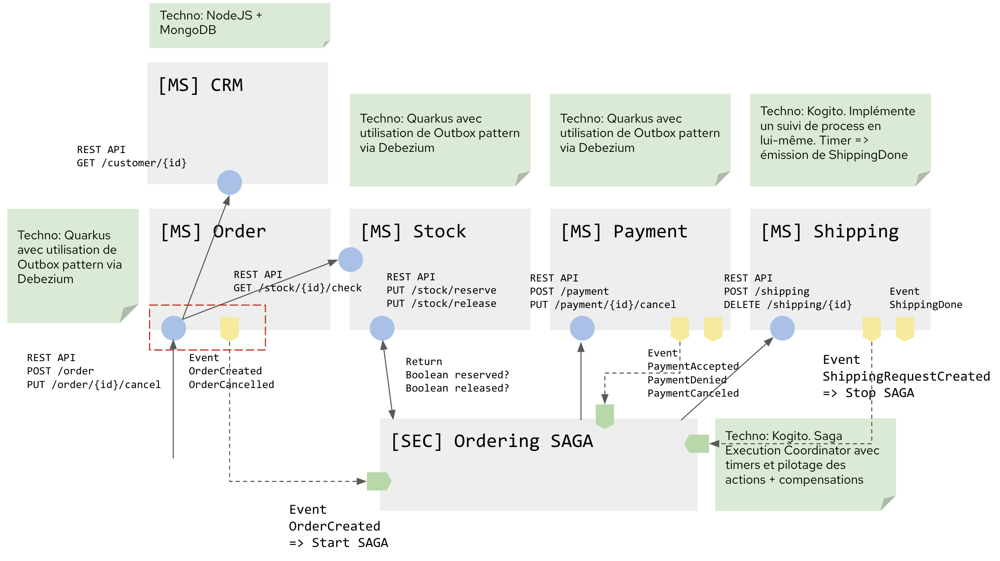

# microservices-saga-blueprint
Architecture blueprint for demonstrating Saga with microservices


 

## Pre-requisites

```shell
sh-4.4$ psql
psql (10.17)
Type "help" for help.

postgres=# \l
List of databases
Name    |  Owner   | Encoding |  Collate   |   Ctype    |   Access privileges   
-----------+----------+----------+------------+------------+-----------------------
ordersdb  | userIUO  | UTF8     | en_US.utf8 | en_US.utf8 |
postgres  | postgres | UTF8     | en_US.utf8 | en_US.utf8 |
template0 | postgres | UTF8     | en_US.utf8 | en_US.utf8 | =c/postgres          +
|          |          |            |            | postgres=CTc/postgres
template1 | postgres | UTF8     | en_US.utf8 | en_US.utf8 | =c/postgres          +
|          |          |            |            | postgres=CTc/postgres
(4 rows)

postgres=# \c ordersdb
You are now connected to database "ordersdb" as user "postgres".
ordersdb=# \dn
List of schemas
Name  |  Owner   
--------+----------
public | postgres
(1 row)

ordersdb=# \dt
List of relations
Schema |     Name      | Type  |  Owner  
--------+---------------+-------+---------
public | orders        | table | userIUO
public | outboxevent   | table | userIUO
public | product_items | table | userIUO
```

## Deployment

### Order Service

```shell
oc project microsaga-order
oc new-app --template=postgresql-persistent --name=order-database -p DATABASE_SERVICE_NAME=order-database -p POSTGRESQL_DATABASE=ordersdb -e POSTGRESQL_ADMIN_PASSWORD=
oc label dc/order-database app.openshift.io/runtime=postgresql app.kubernetes.io/part-of=order-service-app --overwrite 
```

### Order Saga
```
cd order-saga
```

## start strimzi-all-in-one (kafka)
```docker
 docker compose up
```
## run order services
```mvn
 mvn clean compile quarkus:dev
```
## package order-saga  
```mvn
 mvn clean package
```
## run order-saga orchestrator
```java
 java -jar target/quarkus-app/quarkus-run.jar 
```
call the /order endpoint (POST) through the swagger http://localhost:8086/q/swagger-ui 

use the body :
```json
{
    "id":"12345",
    "status":"CREATED",
    "customerId":"12345",
    "productItems":[
        {
            "productId":"123",
            "quantity":1,
            "price":10.0
        }
    ],
    "totalPrice":10,
    "currency":"EUR",
    "paymentCardId":"1234",
    "shippingAddressId":"1234"
}
```
Or using curl 
```json
curl -X 'POST' \
  'http://localhost:8086/order' \
  -H 'accept: application/json' \
  -H 'Content-Type: application/json' \
  -d ' {
      "id": "12345","status": "CREATED","customerId": "12345","productItems":[{"productId":"123", "quantity":1, "price":10.0}],"totalPrice": 10,"currency": "EUR","paymentCardId": "1234","shippingAddressId": "1234"
   }'
```
# deployment on openshift
## create Kafka cluster
## create Infinispan cluster
## create Kogito kafka/ininispan infra
```shell
oc apply -f order-saga-kogito-infra.yml
```
## create configmap order-saga properties
```
oc create configmap order-saga-cm --from-file=./order-saga/src/main/resources/application.properties --dry-run=client -o yaml | oc apply -f -
```

## deploy order-services
```
oc apply -f ./manifest/order-services.yml 
```
## get order-services endpoint 
```
oc get route order-services --template={{.spec.host}}
*order-services-order-saga.apps.cluster-360f.360f.sandbox163.opentlc.com*
```

## update the endpoints of PaymentRemoteServices/StockRemoteServices/ShippingRemoteServices in  the configmap order-saga-cm
```
oc edit cm/order-saga-cm
```
You should have something like

    ```
    com.redhat.microsaga.rest.PaymentRemoteServices/mp-rest/url=https://order-services-order-saga.apps.{YOUR-OPENSHIFT-CLUSTER}
    com.redhat.microsaga.rest.PaymentRemoteServices/mp-rest/scope=javax.enterprise.context.ApplicationScoped
    com.redhat.microsaga.rest.StockRemoteServices/mp-rest/url=https://order-services-order-saga.apps.{YOUR-OPENSHIFT-CLUSTER}
    com.redhat.microsaga.rest.StockRemoteServices/mp-rest/scope=javax.enterprise.context.ApplicationScoped
    com.redhat.microsaga.rest.ShippingRemoteServices/mp-rest/url=https://order-services-order-saga.apps.{YOUR-OPENSHIFT-CLUSTER}
    com.redhat.microsaga.rest.ShippingRemoteServices/mp-rest/scope=javax.enterprise.context.ApplicationScoped
    ```
## delete the existing order-saga pod (to load the updated configmap)
```
oc delete pod $(oc get pods -l app=order-saga -o custom-columns=POD:.metadata.name --no-headers)
```
## Send a http POST with order to the order-services endpoint, the service will produce a new event in the kafka topic order, this event will trigger the saga-order process
```shell 
curl -X 'POST' \
  'https://order-services-order-saga.apps.cluster-360f.360f.sandbox163.opentlc.com/order' \
  -H 'accept: application/json' \
  -H 'Content-Type: application/json' \
  -d '{"id": "12345","status": "CREATED","customerId": "12345","productItems":[{"id":"12345","productId":"123", "quantity":1, "price":10.0}],"totalPrice": 10,"currency": "EUR","paymentCardId": "1234","shippingAddressId": "1234"}'
```
Below the log of order-saga service (the process)
```log
2021-09-29 10:19:16,442 INFO  [org.kie.kog.add.qua.mes.com.AbstractQuarkusCloudEventReceiver] (vert.x-eventloop-thread-1) Cannot convert to class com.example.OrdersMessageDataEvent_12 from {"specversion":"1.0","type":"order","id":"id","source":"test://test","subject":"foo","datacontenttype":"application/json","dataschema":"http://schema.io","time":"2020-07-23T09:12:34Z","data":{"id":"12345","customerId":"12345","totalPrice":10.0,"productItems":[{"id":12345,"productId":"123","quantity":1,"price":10.0}],"paymentCardId":"1234","shippingAddressId":"1234"}}, ignoring type Optional[OrderPaymentSuccess], exception message is Cannot deserialize value of type `java.lang.String` from Object value (token `JsonToken.START_OBJECT`)
 at [Source: (String)"{"specversion":"1.0","type":"order","id":"id","source":"test://test","subject":"foo","datacontenttype":"application/json","dataschema":"http://schema.io","time":"2020-07-23T09:12:34Z","data":{"id":"12345","customerId":"12345","totalPrice":10.0,"productItems":[{"id":12345,"productId":"123","quantity":1,"price":10.0}],"paymentCardId":"1234","shippingAddressId":"1234"}}"; line: 1, column: 192] (through reference chain: com.example.OrdersMessageDataEvent_12["data"])
process started with the following orderclass Order {
    id: 12345
    status: null
    customerId: 12345
    productItems: [class ProductItem {
        productId: 123
        quantity: 1
        price: 10.0
    }]
    totalPrice: 10.0
    currency: null
    paymentCardId: 1234
    shippingAddressId: 1234
}
ProcessInstanceId 882da294-25e4-490d-91ef-c4a04dac0bab
2021-09-29 10:19:19,031 DEBUG [org.kie.kog.add.qua.mes.com.AbstractQuarkusCloudEventReceiver] (vert.x-eventloop-thread-0) Received message io.smallrye.reactive.messaging.kafka.IncomingKafkaRecord@160b1b4a
2021-09-29 10:19:19,032 DEBUG [org.kie.kog.ser.eve.imp.JsonStringToObject] (vert.x-eventloop-thread-0) Converting event with payload {"specversion":"1.0","type":"stocksuccess","id":"id","source":"test://test","subject":"foo","datacontenttype":"application/json","dataschema":"http://schema.io","time":"2020-07-23T09:12:34Z","data":"StockSuccess","kogitoReferenceId":"882da294-25e4-490d-91ef-c4a04dac0bab"} to class class com.example.OrdersMessageDataEvent_22
2021-09-29 10:19:19,042 DEBUG [org.kie.kog.eve.imp.CloudEventConsumer] (vert.x-eventloop-thread-0) Received message without reference id, starting new process instance with trigger 'stocksuccess'
2021-09-29 10:19:19,144 DEBUG [org.kie.kog.eve.pro.ReactiveMessagingEventPublisher] (pool-12-thread-1) Emitter kogito-processinstances-events is not ready to send messages
```
 